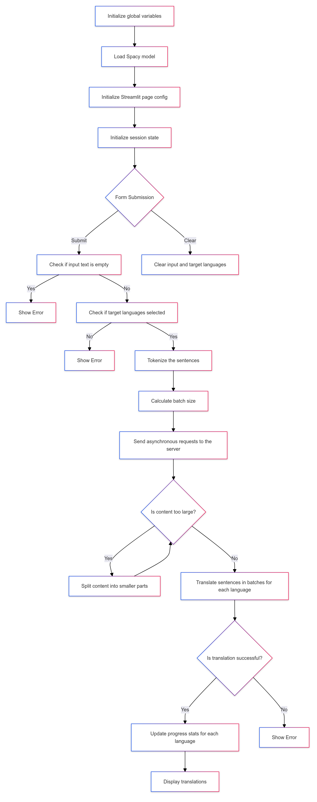

# TranslateNexa: Google Translator Clone

TranslateNexa is a Streamlit-based application that offers asynchronous and efficient translations using Google's translation service. The app is capable of handling large text inputs by breaking them down into manageable batches, providing real-time progress updates, and offering multiple language translations simultaneously.

## Features

- **Asynchronous Translation**: Efficiently handles large inputs with non-blocking requests.
- **Batch Processing**: Splits text into batches to avoid payload limits, ensuring successful translations even for lengthy inputs.
- **Progress Tracking**: Displays real-time translation progress, speed, and statistics for a better user experience.
- **Clear Input**: Reset the input text and language selections with a single click.

## Access the Application

TranslateNexa is hosted on Streamlit Community Cloud and can be accessed directly in production at:  
**[TranslateNexa on Streamlit](https://translatenexa.streamlit.app/)**

## Running Locally

If you wish to run the app locally, follow these steps:

1. Clone the repository:
   ```bash
   git clone https://github.com/MunjPatel/google_translator.git
   ```
2. Go to the current directory:
   ```bash
   cd google_translator
   ```
3. Install the required dependencies:
   ```bash
   pip install -r requirements.txt
   ```
4. Run the Streamlit app:
   ```bash
   streamlit run async_translator.py
   ```
## How It Works


## License

This project is licensed under the MIT License - see the [LICENSE](LICENSE) file for details.
